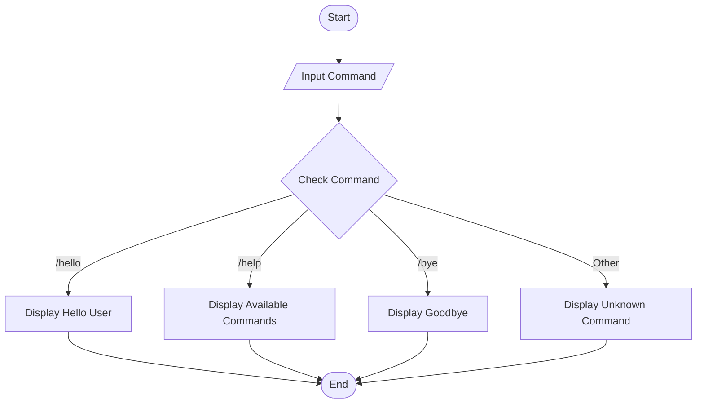
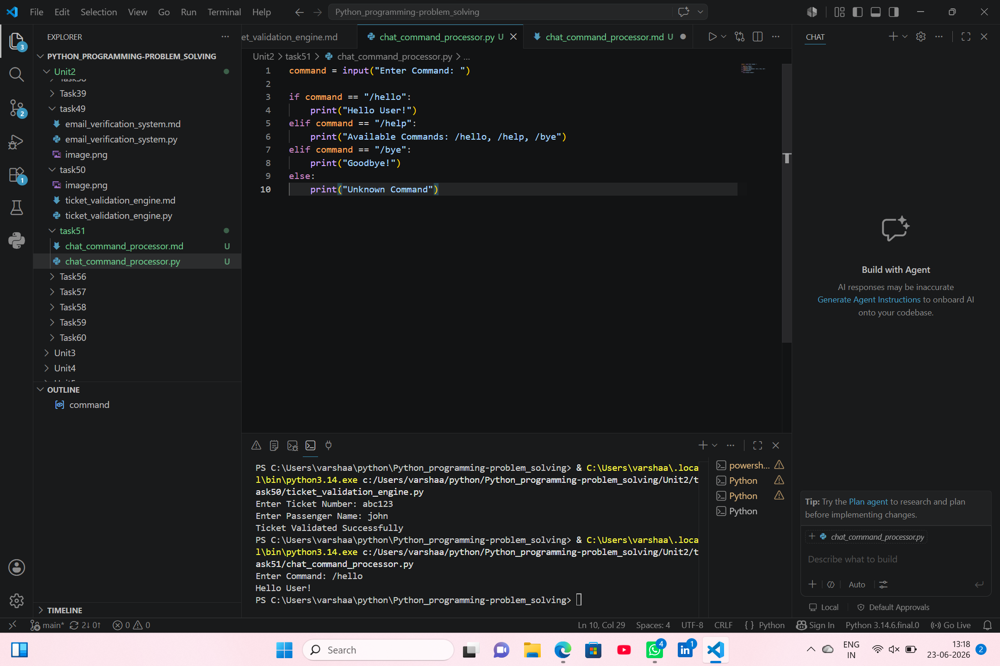

# Chat Command Processor

## 1. Problem Statement

Develop a Python application that interprets and executes predefined chat commands.

---

## 2. Algorithm

1. Start the program.
2. Input a chat command.
3. Compare the command with predefined commands.
4. Execute the corresponding action:
   - `/hello` → Display greeting.
   - `/help` → Display available commands.
   - `/bye` → Display goodbye message.
5. If the command is not recognized, display "Unknown Command".
6. End the program.

---

## 3. Flowchart



---

## 4. Python Source Code

```python

command = input("Enter Command: ")

if command == "/hello":
    print("Hello User!")
elif command == "/help":
    print("Available Commands: /hello, /help, /bye")
elif command == "/bye":
    print("Goodbye!")
else:
    print("Unknown Command")
```

---

## 5. Sample Input/Output

### Sample Input

```text
Enter Command: /hello
```

### Sample Output

```text
Hello User!
```
### screenshot
